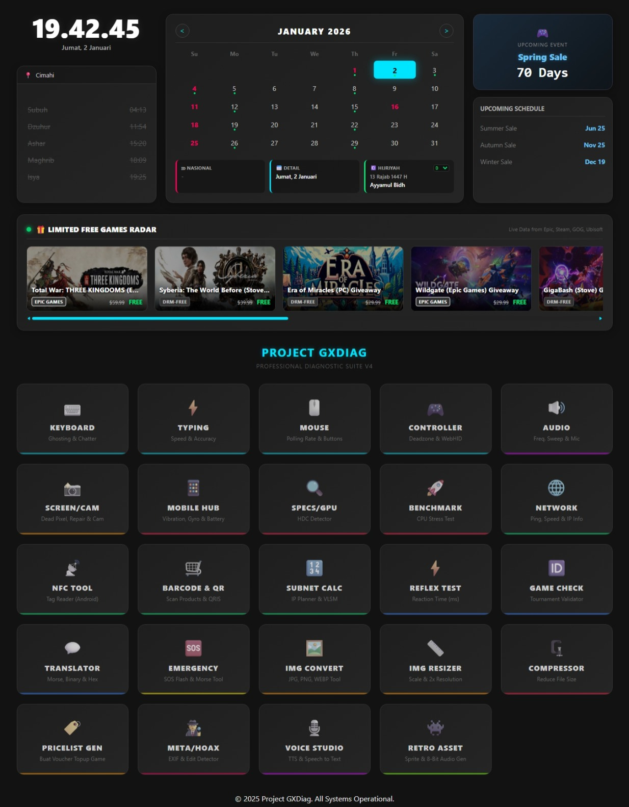

# 🛠️ Project GXDiag (v4.0 Ultimate)

> **The Ultimate Web-Based Hardware Diagnostic Suite & Command Center.**
> A lightweight, modular, and professional tool to test hardware peripherals, analyze networks, generate creative assets, and provide emergency utilities directly from your browser.



## 🔗 Live Demo
🚀 **[Click here to open GXDiag Live](https://gxdiag.brahmantyo12.my.id)**

---

## 🚀 Overview

**Project GXDiag** is a comprehensive diagnostic toolkit built entirely with **Vanilla HTML5, CSS3, and JavaScript**. It creates a centralized "Command Center" dashboard that aggregates real-time environmental data and provides quick access to **22 specialized modules**.

It is designed to be **lightweight, privacy-focused (client-side only), and responsive**. It features **Smart Device Detection**, automatically filtering relevant tools based on whether the user is on a Desktop or Mobile device.

---

## 🎛️ The Command Center (Dashboard)

The main menu (`index.html`) serves as a smart information hub with real-time widgets:

### 1. 🕌 Smart Prayer Schedule
* **Auto-Location:** Detects City/District names using **Nominatim (OpenStreetMap)** via Geolocation.
* **Accurate Times:** Uses **Aladhan API** with `Method 20` (Kementerian Agama RI standard).
* **5-Time List:** Displays the full daily schedule with active time highlighting.

### 2. 📅 Ultimate Interactive Calendar
* **Hybrid Holiday System:**
    * **Fixed:** Hardcoded dates for static holidays.
    * **Dynamic:** Auto-syncs with **API-HariLibur** for changing dates (e.g., SKB 3 Menteri updates, Eid, Nyepi).
* **Hijri Support:** Full Hijriyah calendar with **Manual Moon Sighting Correction** (-1 to +1 days).
* **Smart Events:** Auto-detects Sunnah Fasting (Mon/Thu), Ayyamul Bidh, and Major Islamic Holidays.

### 3. 🎮 Gaming Intelligence Hub
* **Steam Sale Monitor:** Visual indicator if a major Steam Sale is currently **LIVE**, with a roadmap of upcoming 2025/2026 sales.
* **🎁 Free Games Radar:** (New!) A smart widget that scans **Epic Games Store, Steam, GOG, and Ubisoft** for limited-time free games. Uses a **Dual-Engine Proxy System** (`corsproxy.io` & `allorigins`) to bypass CORS restrictions effectively in Indonesia.

---

## 🧩 Diagnostic Modules (22 Tools)

The suite includes specialized modules divided into 6 categories:

### ⌨️ Input & Hardware
| Module | Icon | Description |
| :--- | :---: | :--- |
| **Keyboard Tester** | ⌨️ | Visualizes keystrokes, detects Ghosting, and checks for switch chatter (<80ms). |
| **Typing Speed** | ⚡ | WPM & Accuracy test supporting multiple languages (EN, ID, JP, CN, KR). |
| **Mouse Tester** | 🖱️ | Checks Polling Rate (Hz), button actuation, and scroll wheel steps. |
| **Game Controller** | 🎮 | WebHID support for Sony DualSense/DS4 (touchpad data) & analog drift visualization. |

### 📸 Display & Audio
| Module | Icon | Description |
| :--- | :---: | :--- |
| **Screen & Cam** | 📸 | **All-in-One:** Dead Pixel Test, Webcam Check, and **Pixel Repair** (Strobe/Noise to fix burn-in). |
| **Audio System** | 🔊 | Stereo L/R frequency generator (20Hz-20kHz) and Microphone waveform visualizer. |
| **Voice Studio** | 🎙️ | **Speech-to-Text** (Dictation) and **Text-to-Speech** (TTS) engine using native browser API. |

### 📱 System & Sensors
| Module | Icon | Description |
| :--- | :---: | :--- |
| **Mobile Sensors** | 📱 | **Hub:** Visual Bubble Level (Gyroscope), Battery Health monitor, and Vibration/Haptic Tester. |
| **Specs & GPU** | 🔍 | **HDC Detector:** Exposes true GPU Renderer (WebGL) to detect fake/replica phones. |
| **Benchmark** | 🚀 | **Cross-Platform CPU Stress Test.** Detects device type and adjusts scoring standards (Mobile vs Desktop). |

### 🌐 Network & Connectivity
| Module | Icon | Description |
| :--- | :---: | :--- |
| **Network Pro** | 🌐 | Real-time Latency (Ping) to Cloudflare, Jitter analysis, Public IP, and Connection Type detection. |
| **Subnet Calc** | 🔢 | **Network Planner:** Calculate Subnet Mask, Broadcast IP, and Host Capacity based on CIDR or User count. |
| **NFC Tool** | 📡 | Reads NFC Tags serial numbers (UID) and records (Android/Chrome only). |
| **Barcode & QR** | 🛒 | Scans 1D Barcodes (Products/Snacks) and 2D QR Codes (QRIS/URL). Includes QR Generator. |

### 🎨 Creative & Forensics
| Module | Icon | Description |
| :--- | :---: | :--- |
| **Img Converter** | 🖼️ | Convert images between JPG, PNG, and WEBP formats entirely client-side. |
| **Img Resizer** | 📏 | Scale images up/down with quality controls. Useful for reducing file size or 2x upscaling. |
| **Img Compressor**| 🗜️ | Smart compression to reduce image file size without significant quality loss. |
| **Pricelist Gen** | 🏷️ | **Voucher Maker:** Generate professional top-up price lists for game resellers (Mobile Legends, FF, etc). |
| **Retro Asset** | 👾 | **8-Bit Generator:** Create retro pixel art sprites and chiptune sound effects (SFX) instantly. |
| **Meta/Hoax** | 🕵️ | **Digital Forensics:** View EXIF data (Camera Model, GPS, Date) and detect potential photo editing/manipulation. |

### 🆘 Utility & Secret
| Module | Icon | Description |
| :--- | :---: | :--- |
| **Emergency** | 🆘 | **Survival Kit:** Auto SOS Signal (Flashlight + Screen + Sound), Manual Morse Key, and Strobe Light. |
| **Translator** | 💬 | **Cipher Tool:** Convert Text <-> Morse Code (with Audio Playback), Binary, Hexadecimal, and Base64. |
| **Reflex Test** | ⚡ | Measures reaction time in milliseconds (ms) with ranking system (e.g., "Pro Gamer" vs "Grandma"). |
| **Game Check** | 🆔 | **Tournament Tool:** Validates Game IDs for MLBB, FF, PUBG, Genshin, etc. Supports offline regex fallback. |
| **Middle-Earth**| 💍 | **Hidden Module:** Translate English to Elvish (Sindarin/Quenya), Dwarvish, or Black Speech. (Ghost Card). |

---

## 🛠️ APIs & Data Sources

This project relies on the following open-source services:

1.  **[Aladhan API](https://aladhan.com/):** Prayer Times & Hijri conversion.
2.  **[Nominatim (OSM)](https://nominatim.org/):** Reverse Geocoding.
3.  **[API-HariLibur](https://api-harilibur.vercel.app/):** Syncing Indonesia's National Holidays.
4.  **[GamerPower API](https://www.gamerpower.com/):** Aggregator for free game giveaways.
5.  **[Ipify](https://www.ipify.org/):** Public IP Address detection.
6.  **[Isan.eu.org](https://api.isan.eu.org/):** Game Nickname Checker API.
7.  **[CorsProxy.io](https://corsproxy.io/):** High-speed proxy for bypassing CORS restrictions in Indonesia.

---

## 📂 Project Structure

```text
GXDiag-Project/
├── css/
│   └── style.css            # Global Theme (Dark/Neon)
├── modules/
│   ├── keyboard/            # Ghosting & Chatter Logic
│   ├── typing/              # WPM Logic
│   ├── mouse/               # Polling Rate Logic
│   ├── gamepad/             # WebHID API
│   ├── audio/               # WebAudio Frequency Gen
│   ├── screen-cam/          # Dead Pixel & Repair Tool
│   ├── sensors/             # Gyro, Battery, Vibration
│   ├── specs/               # WebGL Renderer Info
│   ├── benchmark/           # CPU Prime Crunching
│   ├── network/             # Ping & IP Logic
│   ├── subnet/              # IP Calculator Logic
│   ├── nfc/                 # WebNFC Reader
│   ├── qr/                  # HTML5-QRCode Scanner
│   ├── reflex/              # Reaction Time Game
│   ├── gameid/              # Tournament ID Validator
│   ├── emergency/           # Flashlight & SOS Logic
│   ├── translator/          # Morse/Binary Encoder
│   ├── img-converter/       # Client-side Image Conversion
│   ├── img-resizer/         # Canvas Scaling Logic
│   ├── img-compress/        # Blob Compression
│   ├── pricelist-generator/ # Voucher Price List Maker
│   ├── meta-detect/         # EXIF Reader & ELA Analysis
│   ├── voice-studio/        # WebSpeech API Implementation
│   ├── retro-asset/         # 8-Bit Sprite & Audio Gen
│   └── metranslator/        # (Secret) Middle-Earth Translator
├── index.html               # Main Command Center
├── sitemap.xml              # SEO Sitemap
├── LICENSE                  # MIT License File
└── README.md                # Documentation
